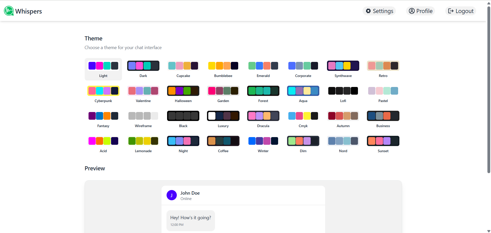

# Whispers - Real Time Chat Application

## About the Project
Whispers is a full-stack, real-time chat application designed for seamless and secure communication. Built using the MERN stack, it supports both text and image messaging, real-time updates via WebSockets, and robust user authentication. It offers a smooth and responsive UI across all devices and includes a dark/light themes toggle.

## Features
- Real-time messaging using WebSockets

- User authentication with JWT

- Share text and image messages

- Light and dark themes

- Responsive design for mobile and desktop

- Secure cookie-based token storage

- Tokens auto-expire every 7 days

- Passwords hashed before storing in database

- HTTPS-only cookies and protection against cross-site scripting (XSS)

## Tech Stack
- Frontend: React.js, Tailwind CSS, Zustand

- Backend: Node.js, Express.js

- Database: MongoDB (with Mongoose)

- Real-time Communication: WebSockets (Socket.io)

- Authentication: JWT (stored in secure HTTP-only cookies)

- Deployment: Render (with SSL support)

## Getting Started
1. Clone the repository

2. Install client and server dependencies using npm install

3. Configure your .env files with MongoDB URI, JWT secret, etc.

4. Start both client and server

5. Open the app in your browser

## Screenshots

## Deployment
Whispers is deployed on Render with automatic HTTPS and SSL encryption enabled.
[Click here to visit the app](https://whispers-gi7r.onrender.com/)

## Contributing
Contributions are welcome! If you'd like to suggest improvements or fix bugs, please fork the repository, make changes, and submit a pull request.

## Contact
- Email: aryansameer1201@gmail.com
- GitHub: https://github.com/@Aryan-Samee
